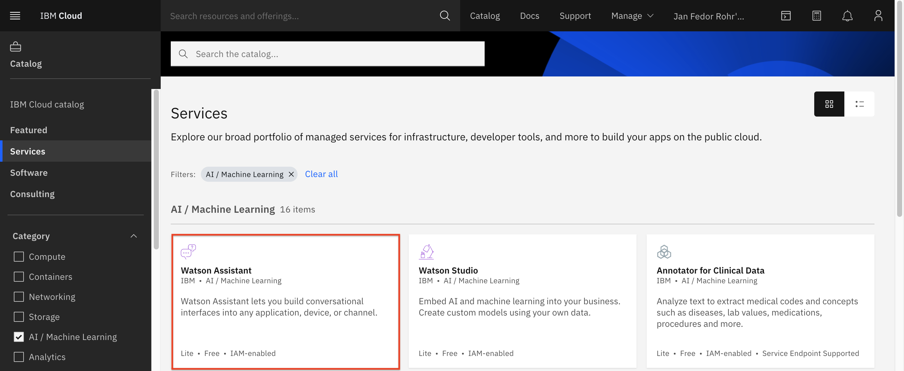
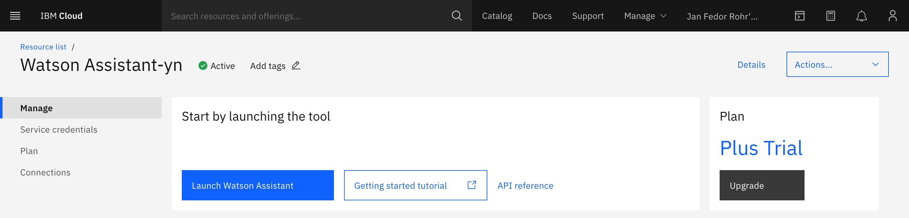
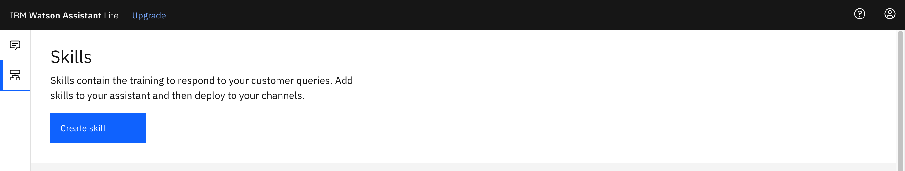
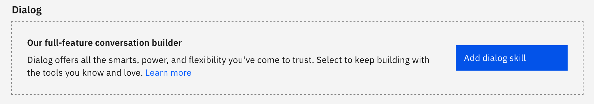
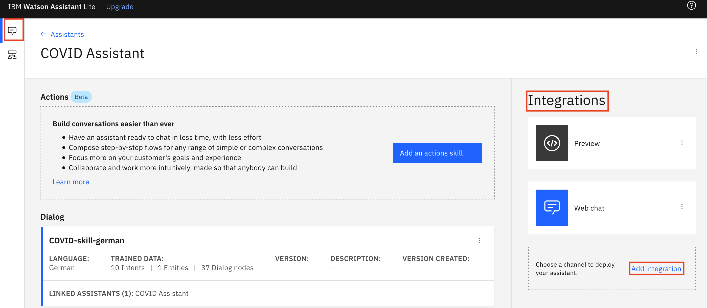
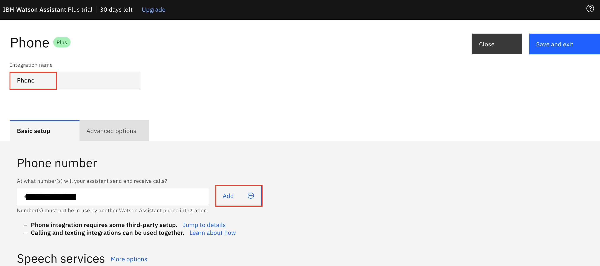
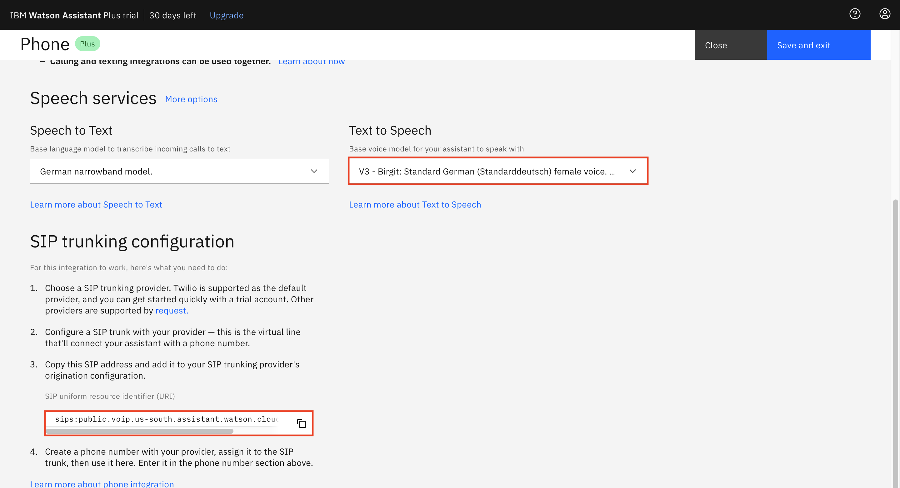

<h1 align="center" style="border-bottom: none;">:rocket: Phone Integration</h1>
<h3 align="center">In this hands-on tutorial you will add a Phone integration to the Watson assistant on the IBM Cloud that can listen and respond directly to customers using natural language over the telephone.</h3>

## Prerequisites

1. Sign up for an [IBM Cloud account](https://cloud.ibm.com/registration).
2. Fill in the required information and press the „Create Account“ button.
3. After you submit your registration, you will receive an e-mail from the IBM Cloud team with details about your account. In this e-mail, you will need to click the link provided to confirm your registration.
4. Now you should be able to login to your new IBM Cloud account ;-)

## Configuring the Watson Assistant on the IBM Cloud

<h4>1) Create a Watson Assistant Service</h4>
After the login you will see your IBM Cloud Dashboard. In the upper menu bar click Catalog. In the Catalog section, click on the AI category, then select Watson Assistant. On the next page select the Lite Plan - or the Plus Trial - these should cover all deployment options and you can also choose a region, where you would like to deploy your service as well as a service name. Click "Create".

 
<h4>2) Access your Watson Assistant Service</h4>
Go back to your IBM Cloud Dashboard by clicking the IBM Cloud Logo on the upper left. Under services you will find the Watson Assistant Service in the corresponding region. Access your service by launching it. 

<h4>3) Import json to your Watson Assistant</h4>
Click on the IBM Cloud logo in the upper left to get back to your dashboard. Then click services to select your Watson Assistant service and launch it. Create a new Skill and choose Dialog Skill.

Then select Import Skill and upload either the 

- skill-COVID-skill-german.json or the
- skill-banking-balance-enquiry.json or the 
- skill-pizza-order-book-table.json. 

You will see the intents, entities and the dialog. To learn more about these and the Watson Assistant click <a href="https://github.com/FelixAugenstein/watson-assistant-tutorial">here</a>.

## Configuring the Twilio Account

1. Register for [Twilio](https://www.twilio.com/) and Start a free Trial.
2. Confirm your email.
3. Verify your phone number. Therefore, use the phone number you will use to call the Watson Assistant later on. You will receive a verification code.

4. After the successful registration you can skip the intro and go directly to your dashboard, where you click “Get a trial number”, then click choose this number. It is important that you choose the provided number without trying to change it and save it for the next part.

## Configuring the phone Integration 

Now we need to set up our Watson Assistant phone integration to enable it as a Voice Agent.

1. In your IBM Watson Assistant Dashboard go to the integrations column on the rught and click on Add integration. 

2. Then choose Phone and click on Create. If haven't already started your 30 day free Plus trial, you will have to start it, because this integration is part of the Plus Trial. 

    When you're done, it should like this.

3. Now you have the option to name your integration and you will have to paste in your Twilio Phone number, which you created and saved earlier.

    Below the Text to Speech header you can also choose the voice for your voice assistant.

4. If you scroll down you will find the SIP trunking configuration with a SIP adress, which you will have to copy and save for the next part.

    Don't forget to save the integration (upper right corner)!

## Connect Watson Assistant to Twilio 

Now we go back to Twilio and connect it with the Assistant.

1. Click the three dots symbol on the left-hand side and select Elastic SIP Trunking. Select Trunks and Create new SIP Trunk.

2. Give your SIP Trunk a Name, such as “Watson Demo Your Name”, then click Create.

3. Go to Origination and add new Origination URI.

4. Now add the Origination SIP URI from your Twilio account, don’t change priority and weight and click Add.

5. Then go to your Phone Numbers and click on your number. Under Voice & Fax, Configure With, select SIP Trunk. Then below choose a SIP Trunk and select the name you gave your SIP Trunk. Then click save.

 

Now you should be able to call your Watson Assistant with your verified phone.

## If you have any questions just contact me
Felix Augenstein 
Digital Tech Ecosystem & Developer Representative @IBM 
Twitter: [@F_Augenstein](https://twitter.com/F_Augenstein) 
LinkedIn: [linkedin.com/in/felixaugenstein](https://www.linkedin.com/in/felixaugenstein/)
