<h1 align="center" style="border-bottom: none;">:rocket: IBM Digital Tech Tutorial: Voice Agent</h1>
<h3 align="center">In this hands-on tutorial you will create a new Voice Agent with Watson on the IBM Cloud that can listen and respond directly to customers using natural language over the telephone.</h3>

## Prerequisites

1. Sign up for an [IBM Cloud account](https://cloud.ibm.com/registration).
2. Fill in the required information and press the „Create Account“ button.
3. After you submit your registration, you will receive an e-mail from the IBM Cloud team with details about your account. In this e-mail, you will need to click the link provided to confirm your registration.
4. Now you should be able to login to your new IBM Cloud account ;-)

## Set up the required IBM Cloud services

<h4>1) Create the Voice Agent & additional services</h4>
After the login you will see your IBM Cloud Dashboard. In the upper menu bar click Catalog. In the Catalog section, search for "Voice Agent" and click on it. Select Dallas as the region and use the Lite Plan. Click "Create".
Repeat this process to create three additional services: 

1. Watson Assistant
2. Speech to Text and
3. Text to Speech.

For these services select the region of your choice and the Lite Plan.

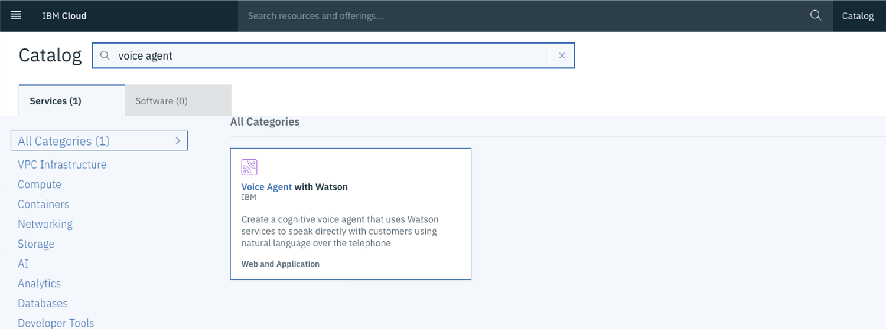

<h4>2) Import json to your Watson Assistant</h4>
Create a new Skill and choose Dialog Skill, then select Import Skill and upload either the 

- skill-banking-balance-enquiry.json or the 
- skill-pizza-order-book-table.json. 

You will see the intents, entities and the dialog. To learn more about these and the Watson Assistant click <a href="https://github.com/FelixAugenstein/digital-tech-tutorial-watson-assistant">here</a>.

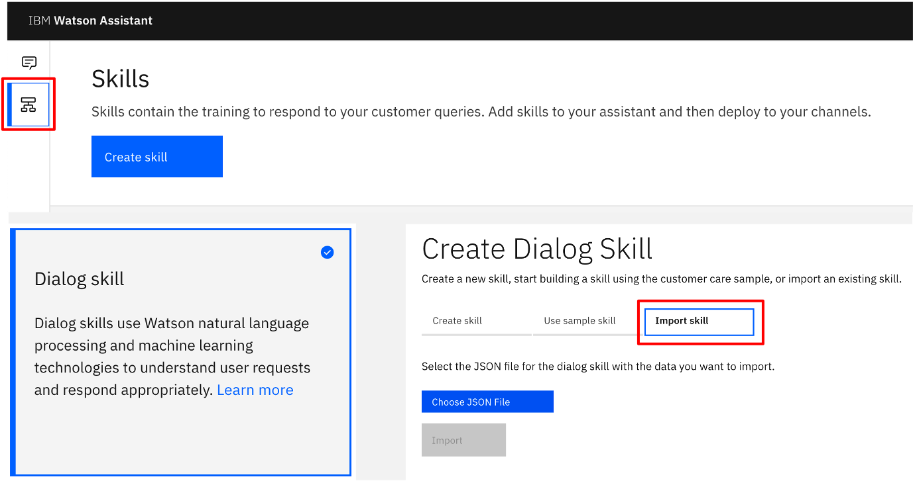

## Configuring the Twilio Account

1. Register for [Twilio](https://www.twilio.com/) and Start free Trial 
2. Confirm your email.
3. Verify your phone number. Therefore, use the phone number you will use to call the Watson Voice Agent later on. You will receive a verification code.

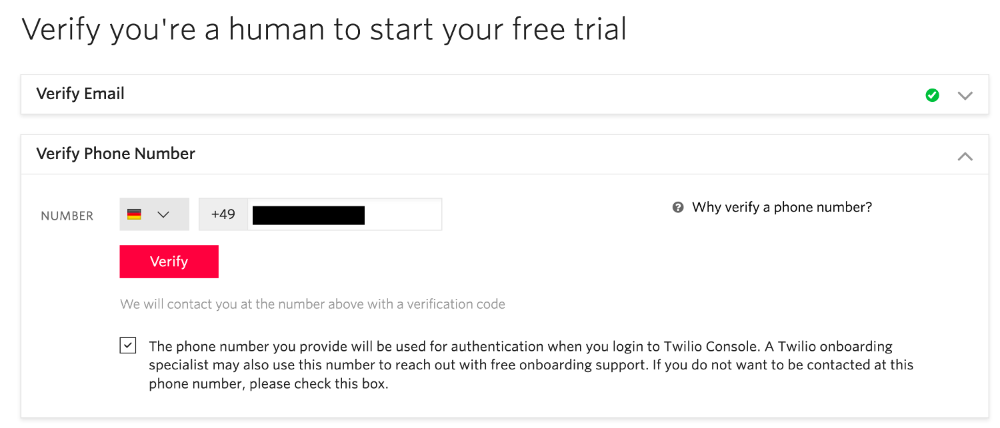

4. After the successful registration you can skip the intro and go directly to your dashboard, where you click “Get a trial number”, then click choose this number.

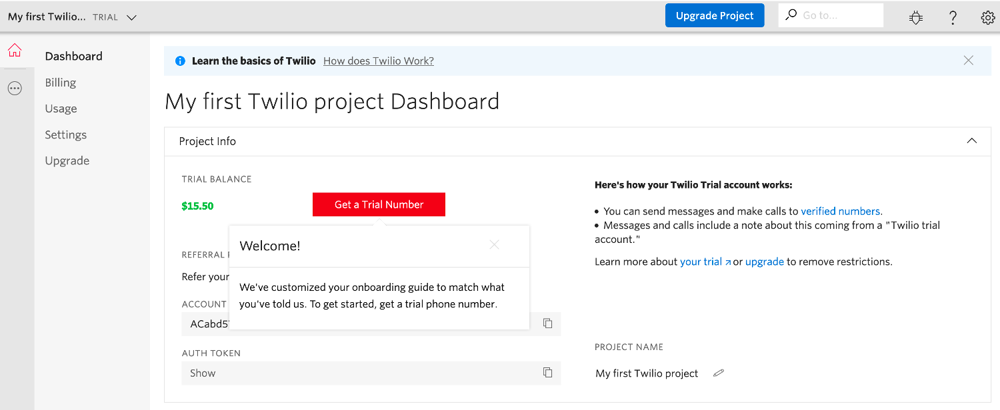

5. Copy and save the Account SID and Auth Token provided to you. You will need this information later on.

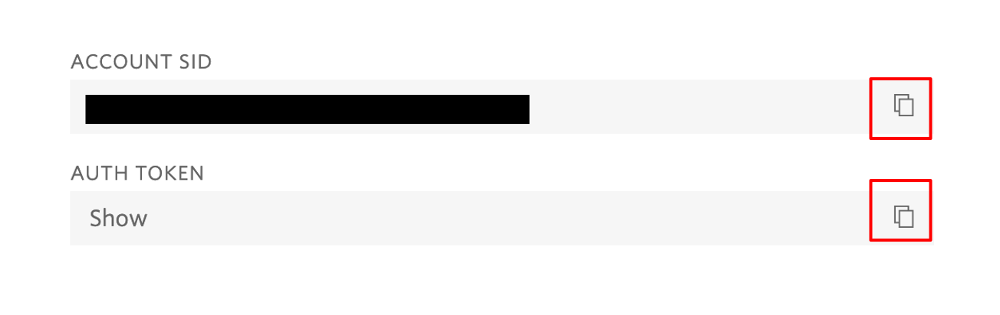

6. Click the three dots symbol on the left-hand side and select Elastic SIP Trunking. Select Trunks and Create new SIP Trunk.

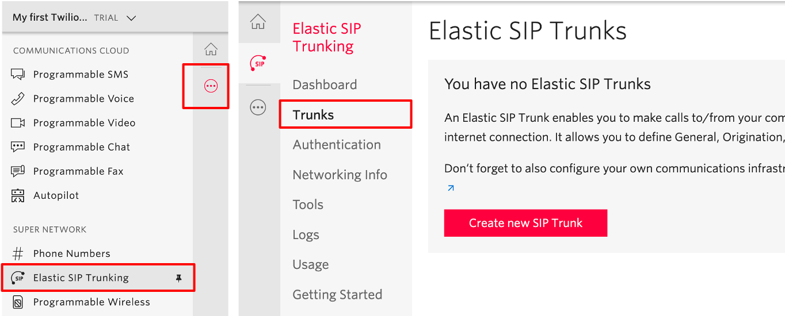

7. Give your SIP Trunk a Name, such as “Watson Demo Your Name”, then click Create.

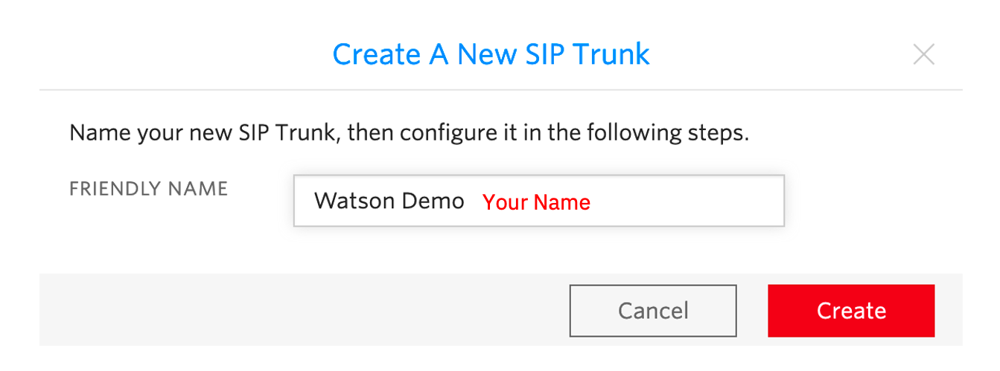

8. Go to Origination and add new Origination URI.

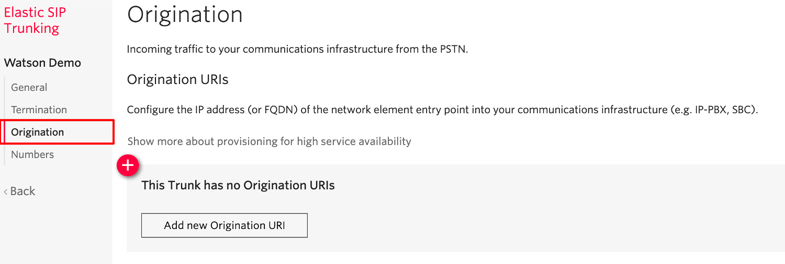

9. You can find your origination SIP URI under Getting started in your Voice Agent in the IBM Cloud, for the Location Dallas it is always the same: `sip:us-south.voiceagent.cloud.ibm.com`

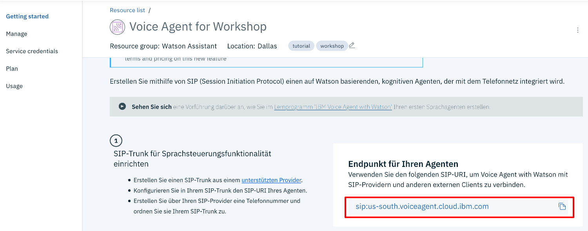

10. Add the Origination SIP URI, don’t change priority and weight and click Add.

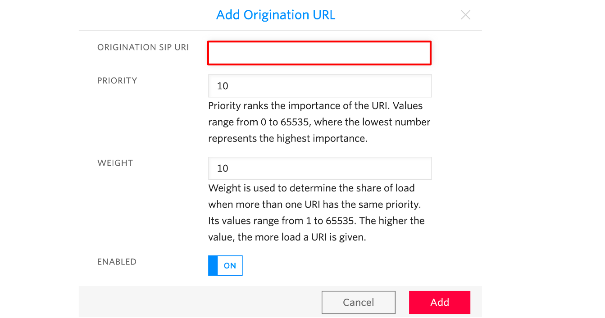

11. Then go to your Phone Numbers and click on your number. Under Voice & Fax, Configure With, select SIP Trunk. Then below choose a SIP Trunk and select the name you gave your SIP Trunk. Then click save.

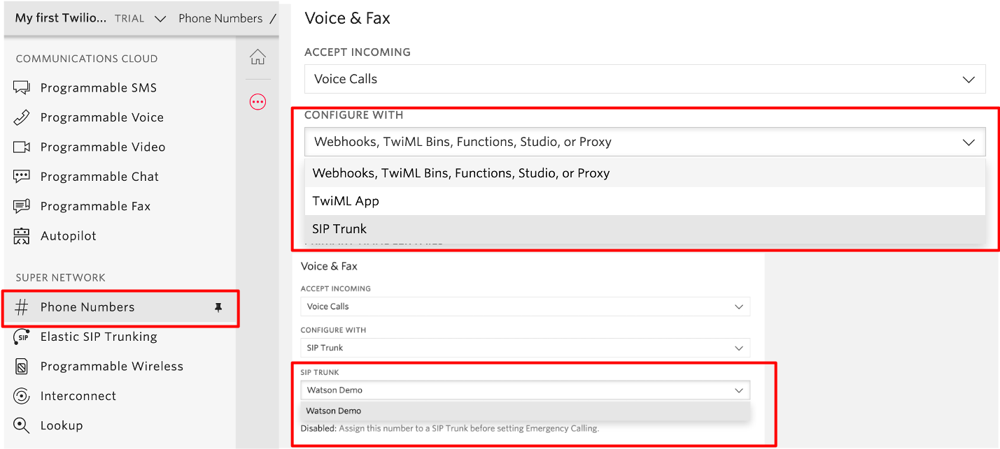

## Configuring the Voice Agent on the IBM Cloud

1. In your IBM Cloud Account go to the dashboard by clicking the IBM Logo in the upper left. Go to services and click on your Voice Agent, then click create Agent.

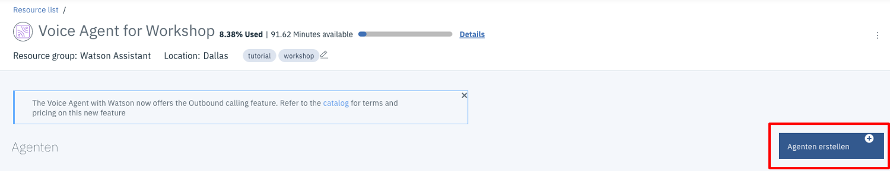

2. For type select `Speech+SMS`, give it a name, put in your (Twilio) phone number and SMS-Provider, user name, password and SMS-URL provide your previously generated (Twilio) Account SID, Auth Token and the Twilio API `https://api.twilio.com`.

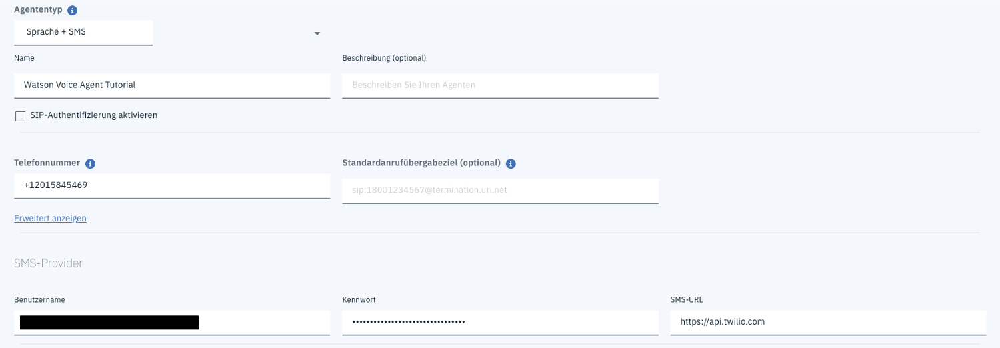

3. Then provide your Watson Assistant service info, such as service instance and skill name and select auto generated service credentials.

4. Select your previously created Text 2 Speech and Speech to Text instances, choose a model and speaker and select auto generated service credentials, as well.

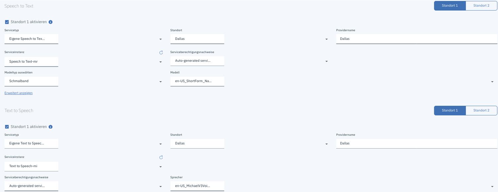

Save your Voice Agent. Now you should be able to call your Voice Agent with your verified phone.

## If you have any questions just contact me
Felix Augenstein 
Digital Tech Ecosystem & Developer Representative @IBM 
Twitter: [@F_Augenstein](https://twitter.com/F_Augenstein) 
LinkedIn: [linkedin.com/in/felixaugenstein](https://www.linkedin.com/in/felixaugenstein/)
